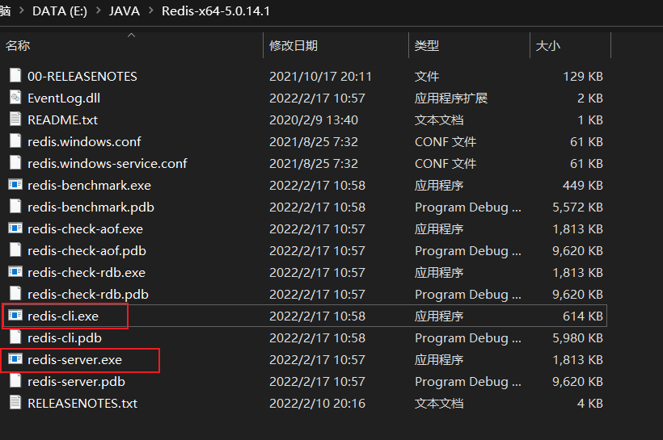
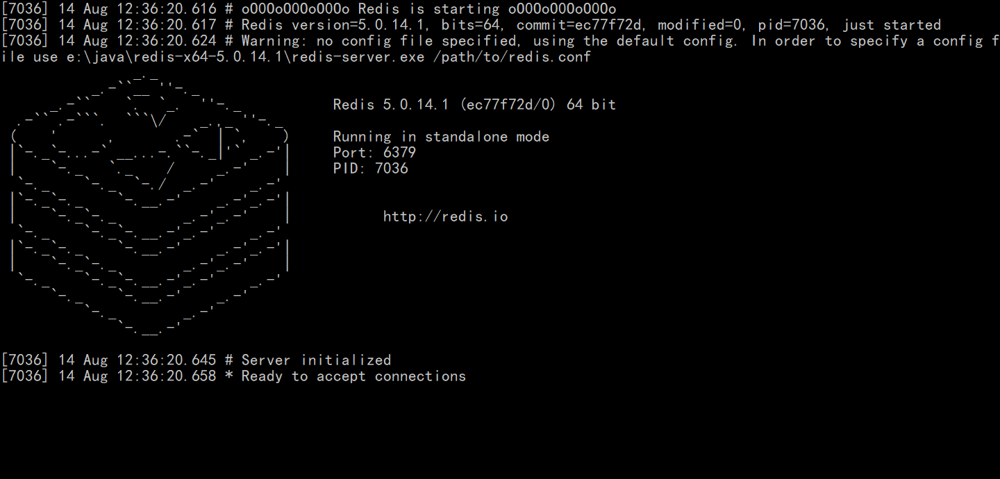
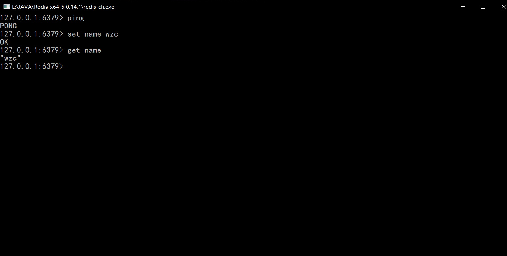
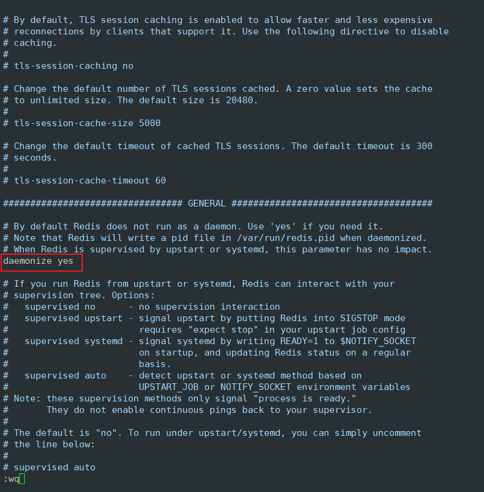
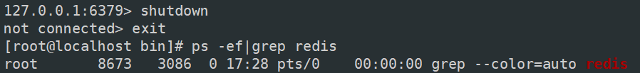
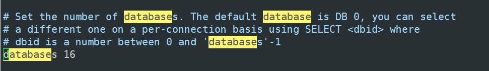

# Redis 笔记

## 概述

### Redis能干嘛

1. 内存存储、持久化
2. 高速缓存
3. 发布订阅系统
4. 地图信息分析
5. 计时器、计数器（浏览量）
6. ...

## Windows安装Redis

1. 下载地址：https://github.com/tporadowski/redis/releases
2. 下载解压后打开redis-server.exe和redis-cli.exe

​	

​	

3. 输入ping测试连接，set设置key value，get获取



## Linux安装Redis

1. 下载安装包https://redis.io/download/
2. `tar -zxvf redis-7.0.4.tar.gz` 解压
3. `yum install gcc-c++`安装环境
4. 进入redis解压目录`make && make install`
5. redis默认安装目录：/usr/local/bin

6. redis默认不是后台启动，修改配置daemonize为yes

    

	7. 启动redis服务：进入/usr/local/bin/，执行`redis-server ../src/redis-7.0.4/redis.conf`
	7. 客户端连接redis：`redis-cli -p 6379`
	7. 查看redis进程：`ps -ef|grep redis`
	7. 关闭redis服务：shutdown，exit

​	

## 性能测试

redis-benchmark是一个压力测试工具

- 测试100个并发连接，100000个请求
    - `redis-benchmark -h localhost -p 6379 -c 100 -n 100000`

## 基础知识

1. 默认16个数据库，默认使用第0个



```bash
select <dbid> #切换数据库

dbsize #查看数据库大小

keys * #查看数据库中所有key

flushdb #清空当前数据库

flushall #清空所有数据库
```

2. Redis是单线程的
    - 官方表示Redis是基于内存操作，CPU不是Redis的性能瓶颈，Redis的瓶颈是根据机器的内存和网路带宽，既然可以用单线程实现，就使用了单线程
    - **单线程为什么还这么快？**
        - 误区1：高性能的服务器一定是多线程的
        - 误区2：多线程一定比单线程效率高
        - 对于Redis来说，所有数据全部放在内存中，对于内存系统来说不需要上下文切换，所以单线程比多线程效率更高

## 五大数据类型

### Redis-Key

```sh
exists {key} #当前数据库是否存在某个key

move {key} {db} #将key移动到数据库db中

expire {key} {seconds} #设置key的过期时间为seconds秒

ttl {key} #查看key的剩余过期时间

type {key} #查看key的类型
```

### String (字符串)

```sh
set {key} {value}

get {key} {value}

append {key} {value} #在key值中追加value，如果key不存在就相当于set key

strlen {key} #查看key的长度

incr {key} #key值自增1

decr {key} #key值自减1

incrby {key} {increment} #key值自增increment

decrby {key} {increment} #key值自减increment

getrange {key} {start} {end} #截取key值的start到end

setrange {key} {start} {value} #start开始替换key值为value

setex {key} {seconds} {value} #设置key值为value，seconds秒后过期，setex (set with expire)

setnx {key} {value} #如果key不存在，设置key值为value，setnx (set if not expire)

mset {key1} {value1} {key2} {value2} #批量设置

mget {key1} {key2} #批量获取

msetnx {key1} {value1} {key2} {value2} #如果所有key都不存在，批量设置

mset {object}:{id}:{field} #key命名方式

getset {key} {value} #先获取key值，再设置key
```

### List (列表)

```sh
lpush {key} {value} #左插入value

rpush {key} {value} #右插入value

lrange {key} {start} {end} #获取从start到end的值

lpop {key} #移除list左侧的值

rpop {key} #移除list右侧的值

lindex {key} {index} #获取下标为index的值

llen {key} #获取list长度

lrem {key} {count} {value} #移除key中count个值为value的元素

ltrim {key} {start} {end} #从start到end截取list

rpoplpush {source} {destination} #移除source中的右侧值插入destination中左侧

lset {key} {index} {item} #将list中下标为index的元素替换为item

linsert {key} [before|after] {pivot} {element} #在第一个值为pivot的元素前或后面插入element
```

### Set (集合)

- 集合中的元素不能重复

```sh
sadd {key} {members...} #向集合中添加元素

smembers {key} #查看集合中的元素

sismember {key} {member} #查看元素是否存在集合中

scard {key} #查看集合中的元素个数

srem {key} {member} #移除集合中的元素

srandmember {key} (count) #随机输出集合中的count个元素

spop {key} (count) #随机弹出集合中的count个元素

smove {source} {destination} {member} #将一个集合中的元素移动到另一个集合

sdiff {key} {key...} #查看多个集合与第一个集合的差集

sinter {key} {key...} #查看多个集合的交集

sunion {key} {key...} #查看多个集合的并集
```

### Hash (哈希)

```sh
hset {key} {field} {value} #设置键和值

hget {key} {field} #获取键的值

hmset {key} {field value...} #设置hash的多个键和值

hmget {key} {field...} #获取hash的多个键的值

hgetall {key} #获取hash的所有键和值

hdel {key} {field...} #删除键

hlen {key} #获取hash长度

hexists {key} {field} #判断hash的键是否存在

hkeys {key} #获取hash的所有键

hvals {key} #获取hash的所有值

hincrby {key} {field} {increment} #hash的键自增increment

hsetnx {key} {field} {value} #如果hash中没有这个键就创建
```

### Zset (有序集合)

- 一般用来做排行榜

```sh
zadd {key} {score} {value} #添加value

zrange {key} {start} {end} #获取zset中的值

zrangebyscore {key} {min} {max} [withscores] #升序排列zset中score在min到max之间的元素，withscores表示打印份数

zrevrange {key} {start} {end} [withscores] #根据score降序排列zset中下标为start到end的元素

zrem {key} {member...} #移除zset中的某个元素

zcard {key} #获取集合中的个数

zcount {key} {min} {max} #获取分数在min到max之间的元素个数
```

## 三种特殊数据类型

### Geospatial (地理位置)

- 一般用来进行附近好友的展示

```sh
geoadd {key} {longitude} {latitude} {member} #添加地理位置

geopos {key} {member...} #获取指定成员的位置信息

geodist {key} {member1} {member2} [m|km|mi|ft] #获取两个成员之间的绝对距离，单位：m（米）、km（千米）、mi（英里）、ft（英尺）

georadius {key} {longitude} {latitude} {radius} [m|km|mi|ft] [withcoord|withdist] [count num] #获取圆形区域内的所有成员 withcoord返回成员经纬度，withdist返回距离圆心的直线距离

georadiusbymember {key} {member} {radius}  [m|km|mi|ft] [withcoord|withdist] [count num] #获取圆形区域内的所有成员

geohash {key} {member...} #返回成员的hash值
```

### Hyperloglog (基数统计)

- 一般用来进行用户访问统计。如果容错，可以使用hyperloglog，如果不容错，则使用set集合来存储用户id进行统计

```sh
pfadd {key} {element...} #添加元素

pfcount {key} #返回去重后的元素数量

pfmerge {distkey} {sourcekey...} #合并所有sourcekey并去重得到distkey
```

### Bitmaps (位图)

- 统计用户信息（是否活跃、是否登录），365天打卡信息等

```sh
setbit {key} {offset} {value} #设置第offset位的值value

getbit {key} {offset} #获取第offset位的值

bitcount {key} [start] [end] #从start到end计数
```

##  Redis事务

- **redis单条命令是原子性的，但是事务是不保证原子性的**
- **redis事务没有隔离级别的概念**

```
------ 队列  命令1  命令2  命令3  执行  ------
```

- 所有命令在事务中没有直接被执行，只有发起执行命令的时候才会被执行 

```sh
multi #开启事务

... #命令入队

exec #执行事务

discard #放弃事务
```

>编译型异常（代码有问题，命令有错），事务中所有命令都不会被执行
>
>运行时异常（1 / 0），错误命令抛出异常，其他命令正常执行

## Redis实现悲观锁乐观锁

**悲观锁：**

- 很悲观，认为什么时候都会出问题，做什么事情都要加锁

**乐观锁：**

- 很乐观，认为什么时候都不会出问题，所以不会上锁，更新数据的时候判断一下，是否有人修改过这个数据

1. 获取version
2. 更新的时候比较version

```sh
watch {key} #加乐观锁监视key，如果监视key的值和事务执行前key的值不一致就报错，无法执行事务

unwatch #解除监视 (解锁)，事务执行后会自动解锁
```

## Jedis

1. 导入依赖：

    ```xml
    <dependency>
        <groupId>redis.clients</groupId>
        <artifactId>jedis</artifactId>
        <version>4.3.0-m2</version>
    </dependency>
    ```

2. 测试

    ```java
    public class JedisTest {
    
        @Test
        public void test() {
            Jedis jedis = new Jedis("127.0.0.1", 6379);
            jedis.flushDB();
            // String相关命令测试
            stringTest(jedis);
    
            // 事务测试
            multiTest(jedis);
        }
    
        private void multiTest(Jedis jedis) {
            jedis.set("hello", "init");
            jedis.watch("hello"); //监视hello，如果值发生变化，事务不执行
            jedis.set("hello", "before");
            Transaction transaction = jedis.multi();
            try {
                transaction.set("multi", "test");
                // int i = 1 / 0; //运行时异常，错误命令抛出异常，其他命令正常执行
                transaction.exec();
            } catch (Exception e) {
                e.printStackTrace();
                transaction.discard();
            } finally {
                System.out.println(jedis.get("multi"));
                jedis.close();
            }
        }
    
        private void stringTest(Jedis jedis) {
            System.out.println(jedis.ping());
            System.out.println(jedis.set("name", "wzc"));
            System.out.println(jedis.get("name"));
            System.out.println(jedis.exists("name"));
            System.out.println(jedis.keys("*"));
            System.out.println(jedis.append("age", "22"));
            System.out.println(jedis.incrBy("age", 2));
            System.out.println(jedis.strlen("name"));
            System.out.println(jedis.getrange("name", 0, -1));
            System.out.println(jedis.setrange("name", 0, "robin"));
            System.out.println(jedis.get("name"));
            System.out.println(jedis.mset("play", "game", "climb", "mountain"));
            System.out.println(jedis.mget("play", "climb"));
        }
    }
    ```

    

## SpringBoot整合Redis

> 说明：在Spring2.X之后，原来使用的Jedis被替换为了Lettuce
>
> Jedis采用直连，多线程操作不安全，解决方法是使用Jedis Pool连接池，BIO模式
>
> Lettuce采用Netty，实例可以在多个线程中共享，不存在线程不安全的情况，NIO模式

源码分析：

```java
public class RedisAutoConfiguration {
    public RedisAutoConfiguration() {
    }

    @Bean
    @ConditionalOnMissingBean(name = {"redisTemplate"})
    @ConditionalOnSingleCandidate(RedisConnectionFactory.class)
    //默认的RedisTemplate没有过多的设置，由于泛型不是<String, Object>，可以自己定义redisTemplate替换默认的
    public RedisTemplate<Object, Object> redisTemplate(RedisConnectionFactory redisConnectionFactory) {
        RedisTemplate<Object, Object> template = new RedisTemplate();
        template.setConnectionFactory(redisConnectionFactory);
        return template;
    }

    @Bean
    @ConditionalOnMissingBean
    @ConditionalOnSingleCandidate(RedisConnectionFactory.class)
    //由于String是Redis中最常使用的类型，所以单独提出来了一个template
    public StringRedisTemplate stringRedisTemplate(RedisConnectionFactory redisConnectionFactory) {
        StringRedisTemplate template = new StringRedisTemplate();
        template.setConnectionFactory(redisConnectionFactory);
        return template;
    }
}
```

1. 导入依赖

    ```xml
    <dependency>
        <groupId>org.springframework.boot</groupId>
        <artifactId>spring-boot-starter-data-redis</artifactId>
    </dependency>
    ```

2. 配置连接

    ```yaml
     spring:
     	redis:
            host: 127.0.0.1
            port: 6379
    ```

    

## Redis.conf详解


## Redis持久化


## Redis发布订阅


## Redis主从复制


## Redis缓存穿透和雪崩


