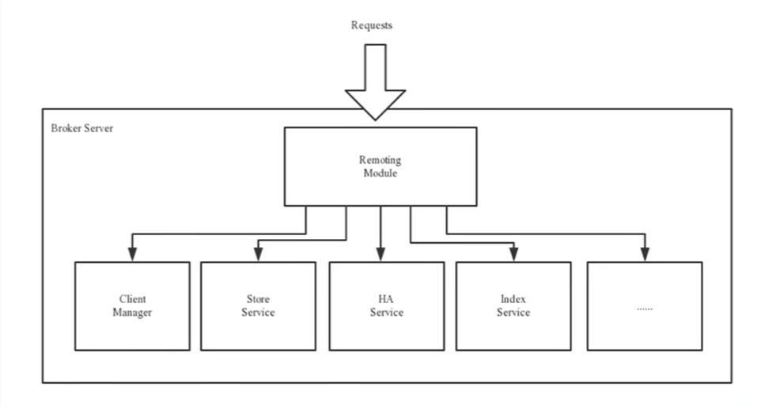
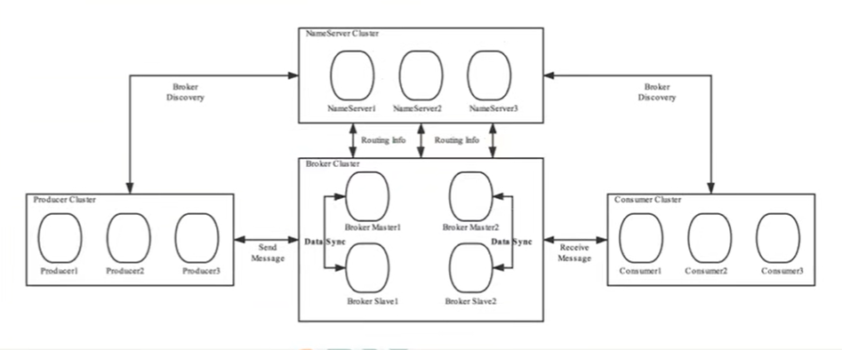
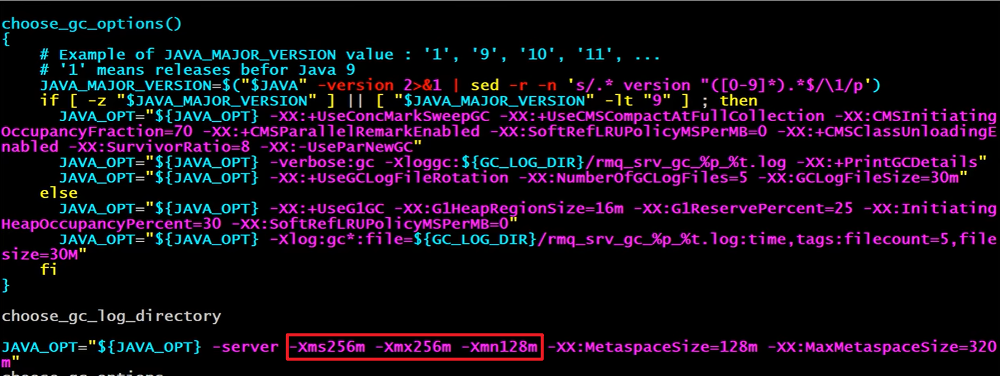

# RocketMQ学习笔记

## RocketMQ概念以及工作流程

### 基本概念

### Producer

### Consumer

### Name Server

#### 功能介绍

#### 路由注册

#### 路由剔除

#### 路由发现

#### Producer和Consumer对NameServer的选择策略

客户端，也就是Producer和Consumer在配置时需要写上NameServer的地址。

在连接时，客户端先生成一个随机数，然后与NameServer节点的个数取模，得到连接NameServer的索引。

如果客户端连接失败，就会采用round-robin轮询策略，逐个连接其他节点。

**首先采用随机策略，失败后采用轮询策略**

> 扩展：Zookeeper Client如何选择Zookeeper Server
>
> 简单来说就是经过两次Shuffle（打乱）
>
> 降配置文件中的zk server地址进行第一次shuffle，然后随机选择一个hostname。由于一个主机名可能对应多个ip地址，所以第二次shuffle就是将该hostname对应的所有ip进行shuffle，然后随机选择

### Broker

#### 功能介绍

Broker充当消息中转的角色，负责存储消息和转发消息。Broker存储了消息相关的元数据，还存储了消费者组消费的进度偏移offset、主题、队列等。

#### 模块构成

Remoting Moudle：整个Broker的实体

Client Manager：客户端管理器，负责解析客户端请求以及管理客户端，如消费者的订阅信息

Store Service：消息存储与查询服务

HA Service：高可用服务，提供主从Broker之间的数据同步

Index Service：索引服务，根据Message key对消息进行索引

#### 集群部署

为了避免broker挂掉后无法消费队列中的消息的问题，将broker分为主从broker。主从broker之间brokername相同，brokerId=0代表主broker，非0代表从broker。主broker负责读写消息操作，从broker负责备份消息，当主broker收到消息后，将消息备份到从broker，这样主broker挂掉后，从broker自动转变为主broker进行读写操作。每个broker与name server集群中的所有节点建立长连接，定时注册topic信息到所有name server

### 工作流程

#### 具体流程

1. 启动name server，name server启动后开始监听端口，等待broker、producer、consumer连接
2. 启动broker后，broker会与所有name server建立长连接，每30秒向name server发送心跳包
3. 发送消息前可以先创建topic也可以在发送消息时在指定topic。创建topic时需要指定该topic的消息存储到哪个broker上，topic与broker的映射关系会存储到name server中
4. 生产者启动后先和一台name server建立连接获取topic与broker之间的路由关系，选择一个队列，然后向broker发送消息，生产者会将路由信息缓存到本地，每30秒更新一次路由信息
5. 消费者启动后和name server建立连接获取订阅topic的路由信息，选择一个队列，消费broker中的消息，将路由信息缓存到本地，每30秒更新一次，同时消费者还会想broker发送心跳包以确保broker没有挂掉

#### topic的创建模式

手动创建topic有两种模式：

- 集群模式：broker集群中所有broker中的队列数量相等

- broker模式：broker集群中的队列数量可以不等

自动创建topic采用broker模式，每个broker中包含4个队列

#### 读写队列

从物理上来看，读写队列是同一个队列，所以不存在读写队列数据同步的问题。读写队列只是逻辑上的概念，在一般情况下，读写队列的数量是一致的。

如果不一致，当写队列为8个，读队列为4个时，系统会创建8个队列，生产者会将消息写到这8个队列中，但是消费者只会消费前4个队列，也就是说后4个队列中的消息，永远不会被消费。

如果读队列的数量大于写队列，系统还是会按两者较大的来创建队列，此时生产者写的队列小于消费者消费的队列数，也就是说会存在没有消息的队列，造成消费者资源的浪费。

之所以将读写队列数分别设置，是为了方便缩容。

如果需要将原来的16个队列，缩容到8个队列，可以先将写队列设置为8，当后8个队列的消息消费完之后再将读队列数量设置为8个，这样就达到了缩容的目的，且不会丢失任何消息。

perm用于设置对topic消息的读写权限：2表示只写，4表示只读，6表示读写

## 单机安装与启动

1. 下载RocketMQ安装包

2. 用unzip命令解压压缩包

3. 修改初始内存

    用vim命令打开bin/runserver.sh和runbroker.sh，修改设置启动内存

    

    

