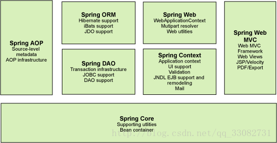
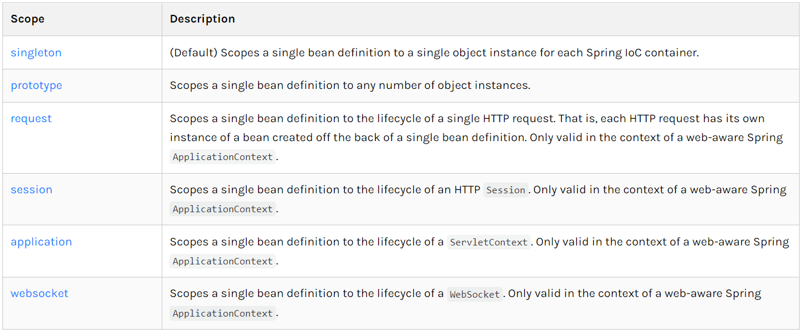
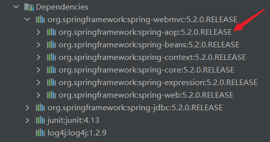
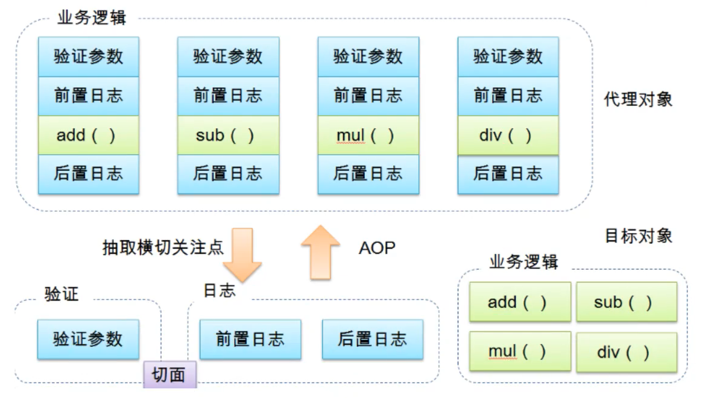
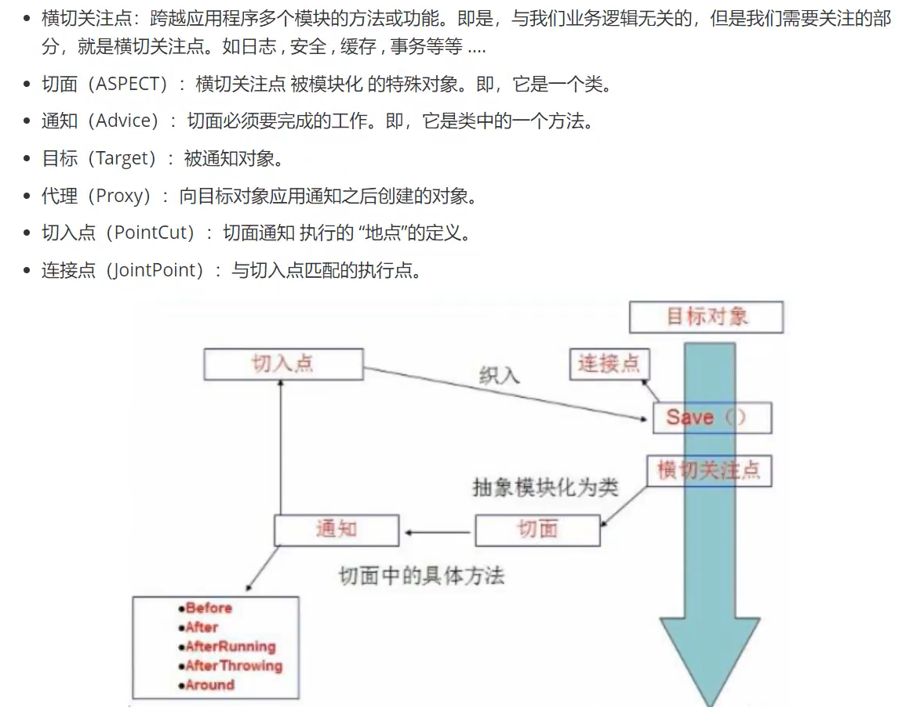
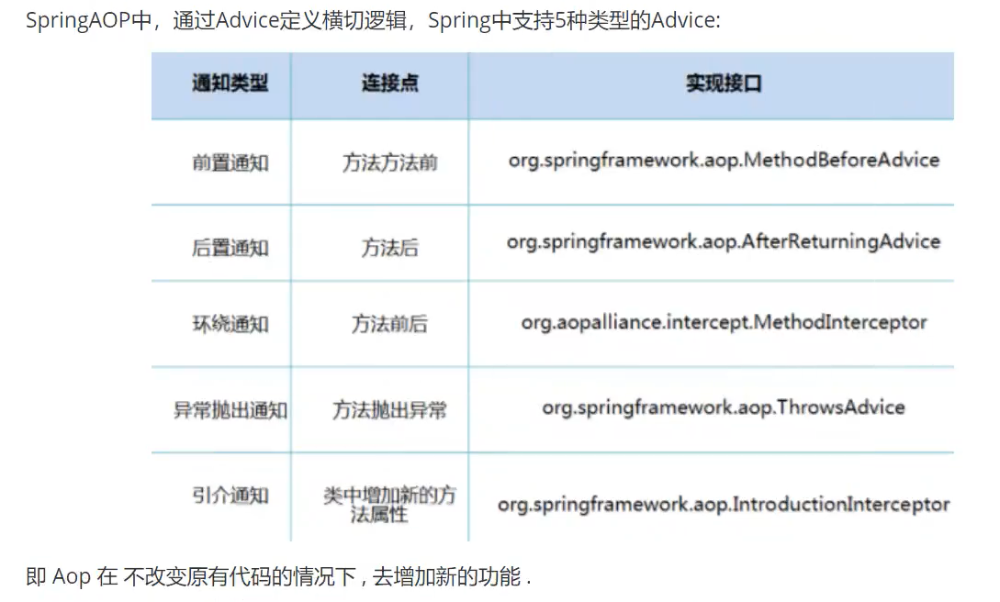

# Spring学习笔记
## 1、介绍
### 1.1、导包
导入spring-webmvc和spring-jdbc
```xml
<project>
    <dependency>
        <groupId>org.springframework</groupId>
        <artifactId>spring-webmvc</artifactId>
        <version>5.2.0.RELEASE</version>
    </dependency>
    <dependency>
        <groupId>org.springframework</groupId>
        <artifactId>spring-jdbc</artifactId>
        <version>5.2.0.RELEASE</version>
    </dependency>
</project>
```
### 1.2、优点
- 开源免费

- 轻量级、非入侵式

- 控制反转（IOC）、面向切面编程（AOP）

- 支持事务处理，对框架整合的支持

总结：Spring就是一个轻量级的控制反转（IOC）和面向切面编程（AOP）的框架

### 1.3、组成


### 1.4、拓展
在Spring官网有这个介绍：现代化的java开发，就是基于Spring的开发

Spring Boot：Build Anything

Spring Cloud：Coordinate Anything

Spring Cloud Data Flow：Connect Everything

- Spring Boot
    - 一个快速开发的脚手架
    - 基于Spring Boot可以快速的开发单个微服务
    - 约定大于配置
    
- Spring Cloud
    - Spring Cloud是基于Spring Boot实现的
    
**弊端：发展了太久之后就违背了原来的理念，配置十分繁琐**

## 2、IOC理论推导
1. UserDao接口
   
2. UserDaoImpl实现类
   
3. UserService业务接口
   
4. UserServiceImpl业务实现类

在之前的业务中，用户的需求可能会影响原来的代码，需要根据需求修改源代码，如果代码量十分大，修改一次的成本十分昂贵

使用一个Set接口实现，已经发生了革命性的变化
```
private UserDao userDao;

//利用set进行动态实现值的注入
public void setUserDao(UserDao userDao) {
    this.userDao = userDao;
}
```
- 之前，程序是主动创建对象，控制权在程序员手上
- 使用了set注入后，程序不再具有主动性，而是变成了被动的接收对象

这种思想，从本质上解决了问题，程序员不再管理对象的创建，系统的耦合性大大降低，可以更加专注于业务的实现，这是IOC的原型

### IoC本质
控制反转IoC（Inversion of Control），是一种设计思想，DI（依赖注入）是实现IoC的一种方法。

没有IoC的程序中，我们使用面向对象编程，对象的创建与对象间的依赖关系完全硬编程在程序中，对象的创建由程序自己控制
控制反转后将对象的创建转移给第三方，获得依赖对象的方式反转了。

**控制反转是一种通过描述（XML或注解）并通过第三方去生产或获取特定对象的方式。在Spring中实现控制反转的是IoC容器，
其实现方法是依赖注入（Dependency Injection，DI）**

## 3、Hello Spring
- 控制：谁来控制对象的创建，传统应用程序的对象是由程序本身控制创建的，使用Spring后，对象是由Spring创建的
- 反转：程序本身不创建对象，而变成被动的接收对象
- 依赖注入：就是利用set方法来进行注入的
IoC是一种编程思想，由主动的编程变成被动的接收
  
## 4、IoC创建对象的方式
1. 使用无参构造创建对象（默认）
2. 如果要使用有参构造创建对象
    1. 下标赋值
    ```
    <bean id="user" class="com.wzc.pojo.User">
        <constructor-arg index="0" value="wzc"/>
    </bean>
    ```
    2. 类型（不建议使用）
    ```
    <bean id="user" class="com.wzc.pojo.User">
        <constructor-arg type="java.lang.String" value="wzc"/>
    </bean>
    ```
    3. 参数名
    ```
    <bean id="user" class="com.wzc.pojo.User">
         <constructor-arg name="name" value="wzc"/>
    </bean>
    ```
总结：在配置文件加载的时候，容器中管理的对象已经初始化了

## 5、Spring配置
### 5.1、别名
```
<!--别名，可以通过别名获取对象-->
<alias name="user" alias="userNew"/>
```
### 5.2、Bean的配置
```
<!--有参构造对象，name也可以取别名，可以取多个-->
<bean id="user" class="com.wzc.pojo.User" name="user2, u2">
    <constructor-arg name="name" value="wzc"/>
</bean>
```
### 5.3、Import
import一般用于团队开发，可以将多个配置文件，导入合并为一个

如果项目中有多人开发，三个人使用不同的类开发，不同的类需要注册在不同的bean中，
可以利用import将所有人的beans.xml合并为一个总的，使用的时候，直接使用总的配置就可以

## 6、依赖注入
### 6.1、构造器注入
前面已经说过
### 6.2、Set方法注入【重点】
- 依赖注入：Set方法注入
    - 依赖：bean对象的创建依赖于容器
    - 注入：bean对象中的所有属性，由容器来注入
    - **name属性值与类中的成员变量名以及set方法的参数名都无关, 只与对应的set方法名有关**
    - **如果通过set方法注入属性，那么Spring会通过默认的空参构造方法来实例化对象，
      所以如果在类中写了一个带有参数的构造方法，一定要把空参数的构造方法写上，
      否则spring没有办法实例化对象，导致报错。**
    ```
    <bean id="address" class="com.wzc.pojo.Address">
        <property name="address" value="北京"/>
    </bean>
    
        <bean id="student" class="com.wzc.pojo.Student">
            <!--普通值注入: 
                Spring会将name值的每个单词首字母转换成大写,
                然后再在前面拼接上"set"构成一个方法名,
                然后去对应的类中查找该方法,通过反射调用,实现注入-->
            <property name="name" value="wzc"/>
            <!--Bean注入-->
            <property name="address" ref="address"/>
            <!--数组注入-->
            <property name="books">
                <array>
                    <value>活着</value>
                    <value>平凡的世界</value>
                    <value>你当像鸟飞往你的山</value>
                </array>
            </property>
            <!--List注入-->
            <property name="hobbies">
                <list>
                    <value>看书</value>
                    <value>打篮球</value>
                    <value>听音乐</value>
                </list>
            </property>
            <!--Map注入-->
            <property name="cards">
                <map>
                    <entry key="身份证" value="110154158754582057"/>
                    <entry key="银行卡" value="1111 2222 3333 4444"/>
                </map>
            </property>
            <!--Set注入-->
            <property name="games">
                <set>
                    <value>穿越火线</value>
                    <value>NBA2KOL2</value>
                    <value>QQ飞车</value>
                </set>
            </property>
            <!--null值注入-->
            <property name="wife">
                <null/>
            </property>
            <!--Properties注入-->
            <property name="info">
                <props>
                    <prop key="学号">1725840658</prop>
                    <prop key="性别">男</prop>
                    <prop key="邮箱">194829422@qq.com</prop>
                </props>
            </property>
        </bean>
    ```
### 6.3、拓展方式注入
使用p命名和c命名空间注入
1. 导入xml约束
```
xmlns:p="http://www.springframework.org/schema/p"
xmlns:c="http://www.springframework.org/schema/c"
```
2. 注入
```xml
<?xml version="1.0" encoding="UTF-8"?>
<beans xmlns="http://www.springframework.org/schema/beans"
       xmlns:xsi="http://www.w3.org/2001/XMLSchema-instance"
       xmlns:p="http://www.springframework.org/schema/p"
       xmlns:c="http://www.springframework.org/schema/c"
       xsi:schemaLocation="http://www.springframework.org/schema/beans
        https://www.springframework.org/schema/beans/spring-beans.xsd">

    <!--p命名空间注入（无参构造，set方法注入），可以直接注入属性的值-->
    <bean id="user" class="com.wzc.pojo.User" p:name="wzc" p:age="22"/>

    <!--c命名空间注入（有参构造）-->
    <bean id="user" class="com.wzc.pojo.User" c:name="wzc" c:age="22"/>
    
</beans>
```
3. 测试
```java
public class UserTest {
    public static void main(String[] args) {
        ApplicationContext context = new ClassPathXmlApplicationContext("userbeans.xml");
        User user = context.getBean("user", User.class);
        System.out.println(user.toString());
    }
}
```
### 6.4、Bean的作用域

1. 单例模式（Spring默认机制）
```
<bean id="user" class="com.wzc.pojo.User" c:name="wzc" c:age="22" scope="singleton"/>
```

2. 原型模式：每次从容器中get的时候都会产生一个新对象
```
<bean id="user" class="com.wzc.pojo.User" c:name="wzc" c:age="22" scope="prototype"/>
```
3. 其余的request、session、application这些只能在web开发中使用到

## 7、Bean的自动装配
- 自动装配是Spring满足bean依赖的一种方式
- Spring会在上下文中自动寻找，并装配属性

在Spring中有三种装配方式
1. 在xml中显示装配
2. 在java中显示装配
3. 隐式的自动装配【重要】

### 7.1、byName自动装配
```
<bean id="dog" class="com.wzc.pojo.Dog"/>
<bean id="cat" class="com.wzc.pojo.Cat"/>

<!--byName会自动在容器上下文中查找bean的id前加上"set"和对应属性的set方法名称相同的bean进行自动注入-->
<bean id="person" class="com.wzc.pojo.Person" autowire="byName">
    <property name="name" value="wzc"/>
</bean>
```
### 7.2、byType自动装配
```
<bean id="dog" class="com.wzc.pojo.Dog"/>
<bean id="cat" class="com.wzc.pojo.Cat"/>

<!--byType会自动在容器上下文中查找bean的类型和该对象属性类型相同的bean进行自动注入（必须保证全局唯一）-->
<bean id="person" class="com.wzc.pojo.Person" autowire="byType">
    <property name="name" value="wzc"/>
</bean>
```
### 7.3、constructor自动装配
```
<bean id="dog" class="com.wzc.pojo.Dog"/>
<bean id="cat" class="com.wzc.pojo.Cat"/>

<!--通过构造方法进行自动注入，Spring会匹配与构造方法参数类型一致的bean进行注入，
如果构造方法参数没有完全匹配则注入失败-->
<bean id="person" class="com.wzc.pojo.Person" autowire="constructor">
    <property name="name" value="wzc"/>
</bean>
```

小结：
- byName的时候，需要保证所有bean的id唯一
- byType的时候，需要保证所有bean的class唯一

## 7.4、使用注解实现自动装配
要使用注解须知：
1. 导入约束：context约束
2. **配置注解的支持**
```xml
<?xml version="1.0" encoding="UTF-8"?>
<beans xmlns="http://www.springframework.org/schema/beans"
       xmlns:xsi="http://www.w3.org/2001/XMLSchema-instance"
       xmlns:context="http://www.springframework.org/schema/context"
       xsi:schemaLocation="http://www.springframework.org/schema/beans
        https://www.springframework.org/schema/beans/spring-beans.xsd 
        http://www.springframework.org/schema/context 
        https://www.springframework.org/schema/context/spring-context.xsd">

    <context:annotation-config/>

</beans>
```

**@Autowired注解**

直接在属性上使用即可，也可以在set方法上使用

科普：
```
@Nullable 字段标记这个注解后，说明这个字段可以为null

//如果定义了@Autowired的require属性为false，说明这个对象可以为空
@Autowired(require = false)
```

**@Autowired默认使用byType方式注入，如果beans.xml中有多个type符合的bean，
则使用@Qualifier(value = "name")注入id为name的bean**
```
@Autowired
@Qualifier(value = "dog")
private Dog dog1;
```

**@Resource注解**
```
@Resource(name = "cat1")
private Cat cat;
```

小结：
@Autowired和@Resource的区别：
- @Autowired默认按照byType方式装配
- @Resource默认按照byName方式装配

## 8、使用注解开发
在Spring4之后，要使用注解开发，必须保证aop的包导入了



使用注解需要导入context约束，增加注解的支持
```xml
<?xml version="1.0" encoding="UTF-8"?>
<beans xmlns="http://www.springframework.org/schema/beans"
       xmlns:xsi="http://www.w3.org/2001/XMLSchema-instance"
       xmlns:context="http://www.springframework.org/schema/context"
       xsi:schemaLocation="http://www.springframework.org/schema/beans
        https://www.springframework.org/schema/beans/spring-beans.xsd
        http://www.springframework.org/schema/context
        https://www.springframework.org/schema/context/spring-context.xsd">

    <context:component-scan base-package="com.wzc"/>
    <context:annotation-config/>


</beans>
```
1. bean

    @Component：表示组件，放在类上表示这个类被Spring管理
2. 属性如何注入
```java
@Component //等价于<bean id="user" class="com.wzc.pojo.User"/>
public class User {

    @Value("wzc") //等价于<property name="name" value="wzc"/>
    private String name;

    public String getName() {
        return name;
    }

    @Value("wzc") //等价于<property name="name" value="wzc"/>
    public void setName(String name) {
        this.name = name;
    }
}
```
3. 衍生的注解

   @Component有几个衍生注解，我们在web开发中，会按照mvc三层架构分层
    - dao：@Repository
    - service：@Service
    - controller：@Controller
   
   这四个注解功能相同，代表将某个类注册到Spring容器中，装配bean
4. 自动装配

    @Autowired

    @Resource
5. 作用域
    
    @Scope(value = "prototype")
6. 小结

    xml与注解：
    - xml更万能，适用于任何场合，维护简单方便
    - 注解只能对当前类生效，维护相对复杂
    - xml一般用来管理bean，注解只负责属性的注入

## 9、使用java的方式配置Spring
所有配置由注解完成

两种方法注入bean：

1. @Component建立的对象通过getBean("user")获取
2. 配置类中定义一个方法，使用@Bean注解声明，通过getBean("getUser")获取

实体类
```java
@Component() //第一种方法直接使用Component注解注入bean，通过getBean("user")来得到bean
public class User {
    @Value("wzc")
    private String name;

    public String getName() {
        return name;
    }

    public void setName(String name) {
        this.name = name;
    }

    @Override
    public String toString() {
        return "User{" +
                "name='" + name + '\'' +
                '}';
    }
}
```
配置类
```java
@Configuration //@Configuration代表这是一个配置类(第二种方法)
@ComponentScan("com.wzc.pojo") //自动扫描com.wzc.pojo下的bean进行注入，这里注入的是user(与第一种方法配合使用)
public class UserConfig {

    @Bean //注册一个Bean，相当于一个bean标签，这个方法的名字就是bean标签中的id，方法的返回值就是bean标签中的class，这里注入的是getUser
    public User getUser() {
        return new User();
    }
}
```
测试类
```java
public class UserTest {
    @Test
    public void test1() {
        //如果使用配置类注入，使用AnnotationConfigApplicationContext来获取容器
        ApplicationContext context = new AnnotationConfigApplicationContext(UserConfig.class);
        User user1 = context.getBean("getUser", User.class);
        User user2 = context.getBean("user", User.class);
        user1.setName("test");
        System.out.println(user1);
        System.out.println(user2);
        System.out.println(user1 == user2); //user1和user2不是同一个对象
    }
}
```
这种纯java的配置方式在SpringBoot中随处可见

## 10、代理模式
代理模式是SpringAOP的底层实现

代理模式的分类：
- 静态代理
- 动态代理

### 10.1、静态代理
角色分析：
- 抽象角色：一般会使用接口或者抽象类来解决 (租房)
- 真实角色：被代理的角色 (房东)
- 代理角色：代理真实角色，代理真实角色后，会做一些附属操作 (中介)
- 客户：访问代理对象 (客户)

代理模式的好处：
- 可以使真实角色的操作更加纯粹，不用关注一些公共的业务
- 公共业务交给代理角色，实现了业务的分工
- 公共业务发生扩展的时候，方便集中管理

缺点：
- 一个真实角色就会产生一个代理角色，代码量会翻倍

接口 (租房)
```java
//租房
public interface Rent {

    public void rent();

}
```

真实角色 (房东)
```java
public class Host implements Rent {

    @Override
    public void rent() {
        System.out.println("房东要出租房子");
    }
}
```

代理角色 (中介)
```java
public class Proxy implements Rent {

    //要代理的角色
    private Host host;

    public Proxy() {
    }

    public Proxy(Host host) {
        this.host = host;
    }

    @Override
    public void rent() {
        lookHouse();
        host.rent();
        signContract();
        fee();
    }

    /**
     * 看房(附属操作)
     */
    public void lookHouse() {
        System.out.println("中介带领看房");
    }

    /**
     * 签合同(附属操作)
     */
    public void signContract() {
        System.out.println("签租赁合同");
    }

    /**
     * 收中介费(附属操作)
     */
    public void fee() {
        System.out.println("收中介费");
    }

}
```

客户端访问代理角色
```java
public class Client {
    public static void main(String[] args) {
        //房东要租房子
        Host host = new Host();
        //代理中介帮房东租房子，代理会有一些附属操作
        Proxy proxy = new Proxy(host);
        //找中介租房子
        proxy.rent();
    }
}
```

### 10.2、静态代理加深理解
接口
```java
public interface UserService {
    public void insert();

    public void delete();

    public void update();

    public void select();
}
```

真实角色
```java
public class UserServiceImpl implements UserService {
    @Override
    public void insert() {
        System.out.println("增加用户");
    }

    @Override
    public void delete() {
        System.out.println("删除用户");
    }

    @Override
    public void update() {
        System.out.println("修改用户");
    }

    @Override
    public void select() {
        System.out.println("查询用户");
    }
}
```

代理角色
```java
public class UserServiceProxy implements UserService {
    private UserServiceImpl userService;

    public void setUserService(UserServiceImpl userService) {
        this.userService = userService;
    }

    @Override
    public void insert() {
        log("insert");
        userService.insert();
    }

    @Override
    public void delete() {
        log("delete");
        userService.delete();
    }

    @Override
    public void update() {
        log("update");
        userService.update();
    }

    @Override
    public void select() {
        log("select");
        userService.select();
    }

    //日志输出(附属方法)
    public void log(String msg) {
        System.out.println("使用了" + msg + "方法");
    }

}
```

客户端
```java
public class Client {
    public static void main(String[] args) {
        //真实角色
        UserServiceImpl userService = new UserServiceImpl();

        //代理角色(添加日至输出)
        UserServiceProxy userServiceProxy = new UserServiceProxy();
        userServiceProxy.setUserService(userService);

        userServiceProxy.insert();
    }
}
```

### 10.3、动态代理
- 动态代理和静态代理角色一样
- 动态代理的代理类是自动生成的(通过反射)，不是直接写好的
- 动态代理分为两大类：基于接口的动态代理，基于类的动态代理
    - 基于接口---JDK动态代理 √
    - 基于类---cglib
    - java字节码实现---javasist

需要了解两个类：Proxy：代理，InvocationHandler：调用处理程序

接口
```java
public interface UserService {
    public void insert();

    public void delete();

    public void update();

    public void select();
}
```

真实角色
```java
public class UserServiceImpl implements UserService {
    @Override
    public void insert() {
        System.out.println("增加用户");
    }

    @Override
    public void delete() {
        System.out.println("删除用户");
    }

    @Override
    public void update() {
        System.out.println("修改用户");
    }

    @Override
    public void select() {
        System.out.println("查询用户");
    }
}
```

InvocationHandler动态代理
```java
public class ProxyInvocationHandler implements InvocationHandler {
    private Object target; //要代理的角色

    public void setTarget(Object target) {
        this.target = target;
    }

    /**
     * 生成代理类
     */
    public Object getProxy() {
        return Proxy.newProxyInstance(this.getClass().getClassLoader(), target.getClass().getInterfaces(), this);
    }

    /**
     * 返回代理实例
     */
    @Override
    public Object invoke(Object proxy, Method method, Object[] args) throws Throwable {
        log(method.getName());
        Object result = method.invoke(target, args);
        return result;
    }

    /**
     * 附属方法：写日志
     */
    public void log(String msg) {
        System.out.println("执行了" + msg + "方法");
    }

}
```

客户端
```java
public class Client {
    public static void main(String[] args) {
        //真实角色
        UserServiceImpl userService = new UserServiceImpl();
        //代理角色
        ProxyInvocationHandler handler = new ProxyInvocationHandler();
        //设置要代理的对象
        handler.setTarget(userService);
        //动态生成代理类
        UserService proxy = (UserService) handler.getProxy();
        proxy.insert();
    }
}
```

动态代理的好处：
- 可以使真实角色的操作更加纯粹，不用关注一些公共业务
- 公共业务交给代理角色，实现了业务的分工
- 公共业务发生扩展的时候方便集中管理
- 一个动态代理类代理的是一个接口，一般就是对应的一类业务
- 一个动态代理可以代理多个类，只要是实现了同一个接口即可

## 11、AOP
### 11.1、什么是AOP
AOP（Aspect Oriented Programming）意为：面向切面编程，
通过预编译方式和运行期动态代理实现程序功能的统一维护的一种技术。
AOP是OOP的延续，是软件开发中的一个热点，也是Spring框架中的一个重要内容，
是函数式编程的一种衍生范型。利用AOP业务逻辑的各个部分进行隔离，
从而使得各部分逻辑之间的耦合度降低，提高程序的可重用性，同时提高了开发效率



### 11.2、AOP在Spring中的作用
**提供声明事务，允许用户自定义切面**



理解：
切面：包含要切入的具体方法的类

通知：切面中的某个具体方法

切入点：具体在哪个类哪个方法进行切入



### 11.3、使用Spring实现AOP
导包
```xml
<dependencies>
    <dependency>
        <groupId>org.aspectj</groupId>
        <artifactId>aspectjweaver</artifactId>
        <version>1.9.4</version>
    </dependency>
</dependencies>
```

方式一：使用Spring的接口
前置通知和后置通知
```java
public class BeforeLog implements MethodBeforeAdvice {
    /**
     * 方法执行前操作
     * @param method 要执行的目标对象的方法
     * @param objects 方法参数
     * @param o 目标对象
     * @throws Throwable
     */
    @Override
    public void before(Method method, Object[] objects, Object o) throws Throwable {
        System.out.println(o.getClass().getName() + "的" + method.getName() + "被执行");
    }
}
```
```java
public class AfterLog implements AfterReturningAdvice {
    /**
     * 方法执行后操作
     * @param o 返回值
     * @param method 要执行的目标对象方法
     * @param objects 方法参数
     * @param o1 目标对象
     * @throws Throwable
     */
    @Override
    public void afterReturning(Object o, Method method, Object[] objects, Object o1) throws Throwable {
        System.out.println("执行了" + method.getName() + "方法，返回结果为" + o);
    }
}
```
配置文件
```xml
<?xml version="1.0" encoding="UTF-8"?>
<beans xmlns="http://www.springframework.org/schema/beans"
       xmlns:xsi="http://www.w3.org/2001/XMLSchema-instance"
       xmlns:aop="http://www.springframework.org/schema/aop"
       xsi:schemaLocation="http://www.springframework.org/schema/beans
        https://www.springframework.org/schema/beans/spring-beans.xsd
        http://www.springframework.org/schema/aop
        https://www.springframework.org/schema/aop/spring-aop.xsd">

    <bean id="userService" class="com.wzc.service.UserServiceImpl"/>
    <bean id="beforeLog" class="com.wzc.log.BeforeLog"/>
    <bean id="afterLog" class="com.wzc.log.AfterLog"/>

    <!--方式一：使用原生接口配置AOP-->
    <aop:config>
        <!--切入点：expression：表达式，execution(要执行的位置 包名.类名.方法名)-->
        <aop:pointcut id="pointcut" expression="execution(* com.wzc.service.UserServiceImpl.*(..))"/>

        <!--执行环绕增强-->
        <aop:advisor advice-ref="beforeLog" pointcut-ref="pointcut"/>
        <aop:advisor advice-ref="afterLog" pointcut-ref="pointcut"/>
    </aop:config>

</beans>
```

方式二：自定义类来实现AOP
自定义类
```java
public class CustomPointCut {
    public void beforeMethod() {
        System.out.println("方法执行前");
    }

    public void afterMethod() {
        System.out.println("方法执行后");
    }
}
```

配置
```xml
<?xml version="1.0" encoding="UTF-8"?>
<beans xmlns="http://www.springframework.org/schema/beans"
       xmlns:xsi="http://www.w3.org/2001/XMLSchema-instance"
       xmlns:aop="http://www.springframework.org/schema/aop"
       xsi:schemaLocation="http://www.springframework.org/schema/beans
        https://www.springframework.org/schema/beans/spring-beans.xsd
        http://www.springframework.org/schema/aop
        https://www.springframework.org/schema/aop/spring-aop.xsd">

    <bean id="userService" class="com.wzc.service.UserServiceImpl"/>

    <!--方式二：自定义类-->
    <bean id="customPointCut" class="com.wzc.custom.CustomPointCut"/>

    <aop:config>
        <!--自定义切面-->
        <aop:aspect ref="customPointCut">
            <!--切入点-->
            <aop:pointcut id="pointcut" expression="execution(* com.wzc.service.UserServiceImpl.*(..))"/>
            <!--通知-->
            <aop:before method="beforeMethod" pointcut-ref="pointcut"/>
            <aop:after-returning method="afterMethod" pointcut-ref="pointcut"/>
        </aop:aspect>
    </aop:config>

</beans>
```

方式三：使用注解实现AOP
切面类
```java
/**
 * 通过注解实现AOP
 */
@Aspect //标注这个类为一个切面
public class AnnotationPointCut {
    @Before("execution(* com.wzc.service.UserServiceImpl.*(..))")
    public void beforeMethod() {
        System.out.println("方法执行前");
    }

    @AfterReturning("execution(* com.wzc.service.UserServiceImpl.*(..))")
    public void afterMethod() {
        System.out.println("方法执行后");
    }

    /**
     * 环绕增强中，可以通过ProceedingJoinPoint来获取处理切入的点
     */
    @Around("execution(* com.wzc.service.UserServiceImpl.*(..))")
    public void aroundMethod(ProceedingJoinPoint joinPoint) throws Throwable {
        System.out.println("环绕前");
        System.out.println("signature：" + joinPoint.getSignature()); //获得签名(方法名全称)
        joinPoint.proceed(); //执行方法
        System.out.println("环绕后");
    }
}
```
配置
```xml
<?xml version="1.0" encoding="UTF-8"?>
<beans xmlns="http://www.springframework.org/schema/beans"
       xmlns:xsi="http://www.w3.org/2001/XMLSchema-instance"
       xmlns:aop="http://www.springframework.org/schema/aop"
       xmlns:context="http://www.springframework.org/schema/context"
       xsi:schemaLocation="http://www.springframework.org/schema/beans
        https://www.springframework.org/schema/beans/spring-beans.xsd
        http://www.springframework.org/schema/aop
        https://www.springframework.org/schema/aop/spring-aop.xsd http://www.springframework.org/schema/context https://www.springframework.org/schema/context/spring-context.xsd">

    <bean id="userService" class="com.wzc.service.UserServiceImpl"/>

    <!--方式三：注解实现AOP-->
    <bean id="annotationPointCut" class="com.wzc.custom.AnnotationPointCut"/>
    <!--开启注解支持-->
    <aop:aspectj-autoproxy/>

</beans>
```

## 12、整合Mybatis
步骤：
1. 导入相关jar包
    - junit
    - mybatis
    - mysql
    - spring相关
    - aop织入
    - mybatis-spring【new】
2. 编写配置文件
3. 测试

### 12.1、回忆Mybatis
1. 编写实体类
```java
@Data
public class User {
    private int id;
    private String name;
    private String pwd;
}
```
2. 编写核心配置文件

mybatis-config.xml
```xml
<?xml version="1.0" encoding="UTF-8" ?>
<!DOCTYPE configuration
        PUBLIC "-//mybatis.org//DTD Config 3.0//EN"
        "http://mybatis.org/dtd/mybatis-3-config.dtd">

<configuration>
    <typeAliases>
        <package name="com.wzc.pojo"/>
    </typeAliases>

    <environments default="development">
        <environment id="development">
            <transactionManager type="JDBC"></transactionManager>
            <dataSource type="POOLED">
                <property name="driver" value="com.mysql.jdbc.Driver"/>
                <property name="url" value="jdbc:mysql://localhost:3306/mybatis?useUnicode=true&amp;characterEncoding=utf8&amp;useSSL=true&amp;serverTimezone=Asia/Shanghai"/>
                <property name="username" value="root"/>
                <property name="password" value="123456"/>
            </dataSource>
        </environment>
    </environments>

    <mappers>
        <mapper class="com.wzc.mapper.UserMapper"/>
    </mappers>
</configuration>
```
pom.xml
```xml
<build>
        <resources>
            <resource>
                <directory>src/main/java</directory>
                <includes>
                    <include>**/*.xml</include>
                </includes>
                <filtering>true</filtering>
            </resource>
        </resources>
    </build>
```
3. 编写接口
```java
public interface UserMapper {
    List<User> selectUser();
}
```
4. 编写Mapper.xml
```xml
<?xml version="1.0" encoding="UTF-8" ?>
<!DOCTYPE mapper
        PUBLIC "-//mybatis.org//DTD Config 3.0//EN"
        "http://mybatis.org/dtd/mybatis-3-mapper.dtd">

<mapper namespace="com.wzc.mapper.UserMapper">
    <select id="selectUser" resultType="com.wzc.pojo.User">
        select * from mybatis.user;
    </select>
</mapper>
```
5. 测试
```java
public class UserTest {
    @Test
    public void test1() throws IOException {
        String resources = "mybatis-config.xml";
        InputStream in = Resources.getResourceAsStream(resources);

        SqlSessionFactory sessionFactory = new SqlSessionFactoryBuilder().build(in);
        SqlSession sqlSession = sessionFactory.openSession(true);

        UserMapper mapper = sqlSession.getMapper(UserMapper.class);
        List<User> userList = mapper.selectUser();
        for (User user : userList) {
            System.out.println(user);
        }
    }
}
```

### 12.2、整合Mybatis
1. 编写数据源配置
```xml
<?xml version="1.0" encoding="UTF-8"?>
<beans xmlns="http://www.springframework.org/schema/beans"
       xmlns:xsi="http://www.w3.org/2001/XMLSchema-instance"
       xsi:schemaLocation="http://www.springframework.org/schema/beans
        https://www.springframework.org/schema/beans/spring-beans.xsd">

    <!--DataSource:使用Spring的数据源替换Mybatis的配置 c30p dbcp druid-->
    <bean id="dataSource" class="org.springframework.jdbc.datasource.DriverManagerDataSource">
        <property name="driverClassName" value="com.mysql.jdbc.Driver"/>
        <property name="url" value="jdbc:mysql://localhost:3306/mybatis?useUnicode=true&amp;characterEncoding=utf8&amp;useSSL=true&amp;serverTimezone=Asia/Shanghai"/>
        <property name="username" value="root"/>
        <property name="password" value="123456"/>
    </bean>

    <!--sqlSessionFactory-->
    <bean id="sqlSessionFactory" class="org.mybatis.spring.SqlSessionFactoryBean">
        <property name="dataSource" ref="dataSource"/>
        <!--绑定Mybatis配置文件-->
        <property name="configLocation" value="classpath:mybatis-config.xml"/>
        <!--<property name="typeAliases" value="com.wzc.pojo.User"/>-->
        <property name="mapperLocations" value="classpath:com/wzc/mapper/*.xml"/>
    </bean>

    <!--sqlSession-->
    <bean id="sqlSession" class="org.mybatis.spring.SqlSessionTemplate">
        <!--只能用构造器注入，因为没有set方法-->
        <constructor-arg name="sqlSessionFactory" ref="sqlSessionFactory"/>
    </bean>

</beans>
```
2. sqlSessionFactory
```xml
<!--sqlSessionFactory-->
<bean id="sqlSessionFactory" class="org.mybatis.spring.SqlSessionFactoryBean">
    <property name="dataSource" ref="dataSource"/>
    <!--绑定Mybatis配置文件-->
    <property name="configLocation" value="classpath:mybatis-config.xml"/>
    <!--<property name="typeAliases" value="com.wzc.pojo.User"/>-->
    <property name="mapperLocations" value="classpath:com/wzc/mapper/*.xml"/>
</bean>
```
3. sqlSessionTemplate
```xml
<!--sqlSession-->
<bean id="sqlSession" class="org.mybatis.spring.SqlSessionTemplate">
    <!--只能用构造器注入，因为没有set方法-->
    <constructor-arg name="sqlSessionFactory" ref="sqlSessionFactory"/>
</bean>
```
4. 实现类，注入Spring
```java
public class UserMapperImpl implements UserMapper {

    //原来所有操作都使用sqlSession来执行，现在使用sqlSessionTemplate
    private SqlSessionTemplate sqlSession;

    public void setSqlSession(SqlSessionTemplate sqlSession) {
        this.sqlSession = sqlSession;
    }

    @Override
    public List<User> selectUser() {
        return sqlSession.getMapper(UserMapper.class).selectUser();
    }
}
```
```xml
<?xml version="1.0" encoding="UTF-8"?>
<beans xmlns="http://www.springframework.org/schema/beans"
       xmlns:xsi="http://www.w3.org/2001/XMLSchema-instance"
       xsi:schemaLocation="http://www.springframework.org/schema/beans
        https://www.springframework.org/schema/beans/spring-beans.xsd">

    <import resource="spring-dao.xml"/>

    <bean id="userMapper" class="com.wzc.mapper.UserMapperImpl">
        <property name="sqlSession" ref="sqlSession"/>
    </bean>

</beans>
```
5. 测试
```java
public class UserTest {
    @Test
    public void test2() throws IOException {
        ApplicationContext context = new ClassPathXmlApplicationContext("applicationContext.xml");
        UserMapperImpl userMapper = context.getBean("userMapper", UserMapperImpl.class);
        List<User> userList = userMapper.selectUser();
        for (User user : userList) {
            System.out.println(user);
        }
    }
}
```

## 13、声明式事务
### 13.1、回顾事务
- 把一组业务当成一个业务来做，要么都成功，要么都失败
- 事务在开发中十分重要，涉及到数据的一致性问题

事务的ACID原则：
- 原子性
- 一致性
- 隔离性
  - 多个业务可能操作同一个资源，防止数据损坏
- 持久性
  - 事务一旦提交，无论系统发生什么问题，结果都不会再被影响，被持久化的写到存储器中

### 13.2、Spring中的事务管理
- 声明式事务：AOP
- 编程式事务：需要在代码中进行事务的管理

mapper
```java
public class UserMapperImpl implements UserMapper {

    //原来所有操作都使用sqlSession来执行，现在使用sqlSessionTemplate
    private SqlSessionTemplate sqlSession;

    public void setSqlSession(SqlSessionTemplate sqlSession) {
        this.sqlSession = sqlSession;
    }

    @Override
    public List<User> transaction() {
        sqlSession.getMapper(UserMapper.class).insertUser(new User(2, "admin", "admin123"));
        sqlSession.getMapper(UserMapper.class).deleteUser(2);
        return sqlSession.getMapper(UserMapper.class).selectUser();
    }

    @Override
    public List<User> selectUser() {
        return sqlSession.getMapper(UserMapper.class).selectUser();
    }

    @Override
    public int insertUser(User user) {
        return sqlSession.getMapper(UserMapper.class).insertUser(user);
    }

    @Override
    public int deleteUser(int id) {
        return sqlSession.getMapper(UserMapper.class).deleteUser(id);
    }
}
```

配置
```xml
<?xml version="1.0" encoding="UTF-8"?>
<beans xmlns="http://www.springframework.org/schema/beans"
       xmlns:xsi="http://www.w3.org/2001/XMLSchema-instance"
       xmlns:aop="http://www.springframework.org/schema/aop"
       xmlns:tx="http://www.springframework.org/schema/tx"
       xsi:schemaLocation="http://www.springframework.org/schema/beans
        https://www.springframework.org/schema/beans/spring-beans.xsd
        http://www.springframework.org/schema/aop
        https://www.springframework.org/schema/aop/spring-aop.xsd
        http://www.springframework.org/schema/tx
        https://www.springframework.org/schema/tx/spring-tx.xsd">

    <!--DataSource:使用Spring的数据源替换Mybatis的配置 c30p dbcp druid-->
    <bean id="dataSource" class="org.springframework.jdbc.datasource.DriverManagerDataSource">
        <property name="driverClassName" value="com.mysql.jdbc.Driver"/>
        <property name="url" value="jdbc:mysql://localhost:3306/mybatis?useUnicode=true&amp;characterEncoding=utf8&amp;useSSL=true&amp;serverTimezone=Asia/Shanghai"/>
        <property name="username" value="root"/>
        <property name="password" value="123456"/>
    </bean>

    <!--sqlSessionFactory-->
    <bean id="sqlSessionFactory" class="org.mybatis.spring.SqlSessionFactoryBean">
        <property name="dataSource" ref="dataSource"/>
        <!--mapper文件位置-->
        <property name="mapperLocations" value="classpath:com/wzc/mapper/*.xml"/>
    </bean>

    <!--sqlSession-->
    <bean id="sqlSession" class="org.mybatis.spring.SqlSessionTemplate">
        <!--只能用构造器注入，因为没有set方法-->
        <constructor-arg name="sqlSessionFactory" ref="sqlSessionFactory"/>
    </bean>

    <!--配置声明式事务-->
    <bean id="transactionManager" class="org.springframework.jdbc.datasource.DataSourceTransactionManager">
        <constructor-arg ref="dataSource"/>
    </bean>

    <!--结合AOP实现事务的织入-->
    <!--配置事务通知-->
    <tx:advice id="txAdvice" transaction-manager="transactionManager">
        <!--name: 给哪些方法配置事务，propagation: 配置事务的传播特性【new】-->
        <tx:attributes>
            <tx:method name="selectUser" read-only="true"/>
            <tx:method name="insertUser" propagation="REQUIRED"/>
            <tx:method name="updateUser" propagation="REQUIRED"/>
            <tx:method name="deleteUser" propagation="REQUIRED"/>
            <tx:method name="*" propagation="REQUIRED"/>
        </tx:attributes>
    </tx:advice>

    <!--配置事务切入-->
    <aop:config>
        <aop:pointcut id="txPrintCut" expression="execution(* com.wzc.mapper.*.*(..))"/>
        <aop:advisor advice-ref="txAdvice" pointcut-ref="txPrintCut"/>
    </aop:config>

</beans>
```

测试
```java
public class UserTest {
    @Test
    public void test1() {
        ApplicationContext context = new ClassPathXmlApplicationContext("applicationContext.xml");
        UserMapper userMapper = context.getBean("userMapper", UserMapper.class);
        List<User> userList = userMapper.transaction();
        for (User user : userList) {
            System.out.println(user);
        }
    }
}
```